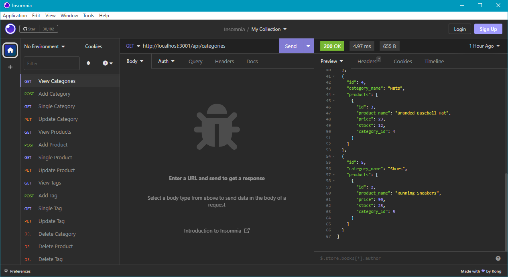

  # E-Commerce Back End

  ## Description

  This is the back end of an e-commerce site. Its function is to interact with a MySQL database.

    The technologies used include Express, MySQL2, Sequelize, and Dotenv.
  
  The challenge that I faced during this project involved at least four errors. Two were due to incorrect or incomplete code, and the other two were not errors - the data was still being posted/updated.
    
  No plans for future development at this time.

  ## Mock

  

  ## Video

  
  
  ## Links

  Repo: https://github.com/Coridane/script-employee-db  